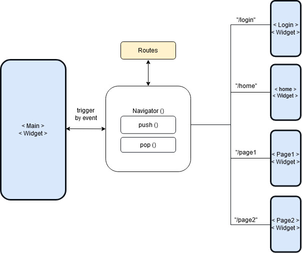
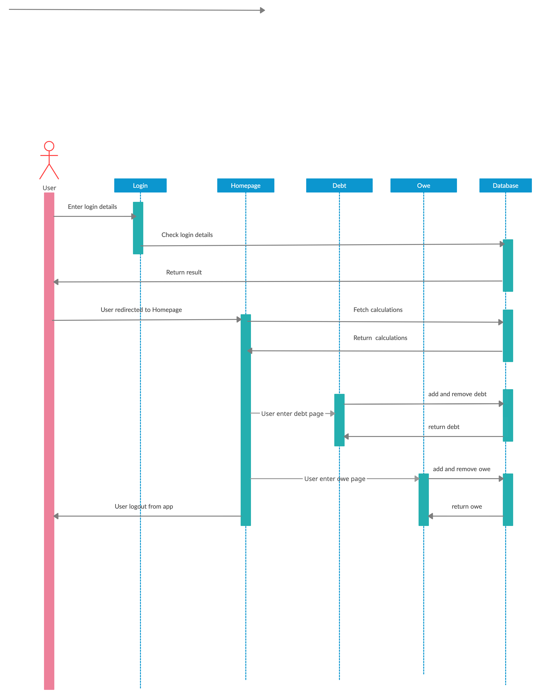

## Group Name: Al-Mukminin

## Group Member Details
      1. ABDUL RAHMAN BIN AHMAD (1721823)
      2. SYED ZAIMI PUTRA AL-JAMALULLAIL BIN SYED YUSOFF (1728655)
      3. HANNAH BINTI HUDA (1814022)

## Title: BukuHutang

## Introduction
BukuHutang is a mobile application project that focus on debt transaction. This app allow you to manage your debts and track people who owe you.

## Objective
    1. Manage debt transaction - allows you to track the debts you owe and the debts owed to you
    2. Remind and help you payoff your debt earlier

## Features and Functionalities
    1. Login/Logout 
    2. Add and delete debt with date
    3. Count total debt from and to you 
    4. Due date notification

## Screen Navigation 
In this poject, the routes are registered in the MaterialApp() root widget. The screen navigate with named routes, runs to a new widget using push() and back to the previous screen using pop().

## Sequence Diagram

BukuHutang

## References
