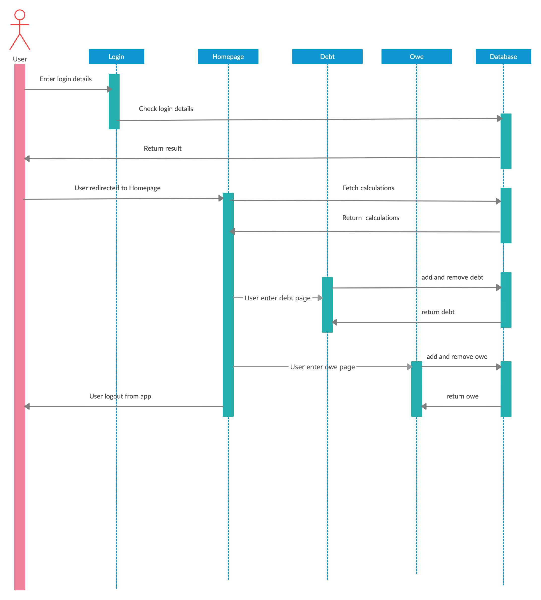

## Group Name: Al-Mukminin

## Group Member Details
      1. ABDUL RAHMAN BIN AHMAD (1721823)
      2. SYED ZAIMI PUTRA AL-JAMALULLAIL BIN SYED YUSOFF (1728655)
      3. HANNAH BINTI HUDA (1814022)

## Title: BukuHutang

## Introduction
Debt is something that us, humans cannot run from. Sometimes we have official debts such as loan to banks that we use to buy houses, lands and cars. At other times we make debts with people on a whim such as with your friends when you do not bring enough cash money. When we make a debt, it is our responsible to pay it as early as possible. Even in Islam, there is hadith mention about the importance of paying debts narrated by Abu Huraira:

The Prophet said, "Procrastination (delay) in paying debts by a wealthy person is injustice. So, if your debt is transferred from your debtor to a rich debtor, you should agree."

However, the older we get, the more debts we are going to make. Sometimes, we tend to dissmiss our debts, espescially the small ones that we make on a whim. No matter how big or small a debt is, it is still our responsibility to pay it. That is where our mobile application, BukuHutang, comes to assist. BukuHutang is a mobile application project that focuses on recording the debt that you make with whoever and whenever. This app allow you to manage your debts easily and keep track of not only the amount that you owe people, but also the amount that people owe you. 

## Objective
The main objective of our mobile application is to help people manage their debt transactions. In the past, people usually write a notebook that keeps the records of debt so that they would not forget about it. We would like to digitize this notebook into a mobile application where the person could record it anywhere and at anytime as long as there is internet connection. As payment of debt is compulsory for every Muslim, with the existance of this application, it would be easier for people to manage and track their debt transactions. Families who have their members passed away could also easily track the debt record of the deceased if the deceased was using the mobile application. To put it simply, the objectives of the mobile application are: 

    1. Manage debt transaction - allows you to track the debts you owe and the debts owed to you
    2. Remind and help you payoff your debt earlier

## Features and Functionalities
Firstly, the user would have login using their Google account to access the application for security purposes. Then they would arrive to the main page where the total debt that you have towards people and the total amount that various people owe you displayed on the page. Below these total there are two buttons, the first navigates you to a page that lists all the person with the amount that you owe them. Likewise, the second page lists people and the amount that they owe you. In these two pages, there is an add button in the bottom left of the page that when clicked, a dialog box would pop up which lets you add a new debt transaction. You can also swipe through any of the specific debt transaction to delete the debt. There is also a person icon in the top right of the homepage which navigates you to your profile which displays your username and also your balance, which is the total amount that people you minus the total amount that you owe people.

    1. Login/Logout 
    2. Count total debt from and to you and also balance
    3. Add debt with date
    4. Delete debt with date

## Screen Navigation 
In this poject, the routes are registered in the MaterialApp() root widget. The screen navigate with named routes, runs to a new widget using push() and back to the previous screen using pop().

## Sequence Diagram

BukuHutang

## Task Distribution

### Syed Zaimi
      1. Provide and designed the foundation of the project, which are the homepage, the debt page and the owe page with the routing to all three pages
      2. Connected the Firestore database to the mobile application and displayed the people and the amount in the debt and owe page in a listTile
      3. Add the add function to the mobile application which adds new debt transactions using a dialog box
      4. Add the delete function using dismissable through the listView which deletes the data in the FireStore.
      5. Help other members regarding the connection with FireStore.
      
 ### Rahman
      1. Create profile page, retrieves email and profile picture from current google sign-in to be displayed in the profile page.
      2. Create and used a simple Splash Screen  plugins to create an Animation for buku hutang logo in the splash screen.
      3. Retrieves the amount of debt & owe from firestore database to be calculated in the homepage and profile page with the help of Syed.
      4. Calculates "your total debt", "total money people owe you" and "Your balance" and display it in homepage and profile page.
      5. A bit alteration on the design, choosed a suitable color palletes for overall user interface.
      
### Hannah Huda
      1. Designed the screen navigation and implement the routing process in root widget. 
      2. Create, setup and configure Firebase project.
      3. Implement Google sign-in and sign-out authentication in the project.
      4. Implement a method in Splash Screen to check if user already signed in before proceed to authentication or home screen.
      5. Assisted Syed validating form in debt and owe screen.
      
## References
Flutter Authentication

      1. https://medium.com/flutterdevs/google-sign-in-with-flutter-8960580dec96
      2. http://www.codeplayon.com/2020/02/simple-flutter-login-screen-ui-example/
      3. https://firebase.flutter.dev/docs/overview/#initializing-flutterfire
      
      
Firestore

      1. https://firebase.flutter.dev/docs/firestore/usage/
      2. https://firebase.google.com/docs/firestore/quickstart
      3. https://firebase.flutter.dev/docs/firestore/usage/
      4. https://medium.com/flutterdevs/using-firebase-firestore-in-flutter-b0ea2c62bc7
      5. https://www.javatpoint.com/firebase-update-and-delete-in-firestore
      6. https://pub.dev/documentation/cloud_firestore/latest/cloud_firestore/QuerySnapshot/docs.html
      7. https://firebase.google.com/docs/projects/learn-more#config-files-objects
      
      
 Others 
      
      1. https://www.javatpoint.com/flutter-lists
      2. https://medium.com/@maffan/how-to-make-a-dismissible-listview-in-flutter-a9f730a751be
      3. https://api.flutter.dev/flutter/widgets/Dismissible-class.html
      4. https://flutter.dev/docs/cookbook/gestures/dismissible
      5. https://medium.com/zipper-studios/the-keyboard-causes-the-bottom-overflowed-error-5da150a1c660
      6. https://pub.dev/packages/date_form_field/example
      7. https://pub.dev/packages/animated_splash_screen
